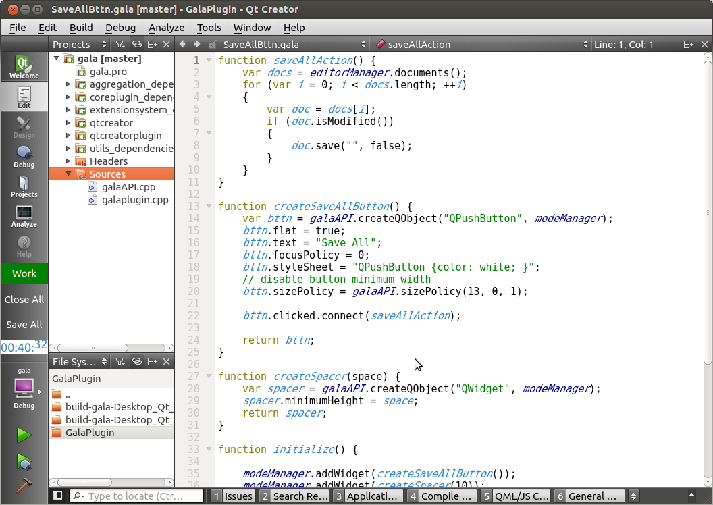
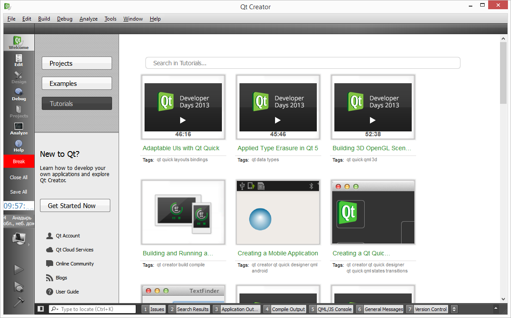

#JsExtensions Plugin
This QtCreator plugin enables writing plugins using JavaScript/QML
#Overview
Plugin allows to easily write simple additions to QtCreator called JEP plugins (*.jep.js files).
JEP plugin files are JavaScript files with most of the QtCreator API avaliable.
You don't need to clone and build QtCreator to develop QtCreator plugins.

You can get a pre-compiled plugin for Linux(Ubuntu) [here](https://github.com/lexxmark/QtCreator-JsExtensions-Plugin/releases/download/v0.0.1/ZhondinLinux64.tar.gz). Just unzip Zhondin folder to the QtCreator plugins folder (you may need to change the version of dependency Core in JsExtensions.pluginspec file - valid range from 3.0.0 to 3.1.1).

Here are some screenshots of JEP plugin:




Videos available [here](http://youtu.be/GGCcGts3B2I) and [here](http://www.youtube.com/watch?v=VHhEt3un_f4).

Here you can see 5 additional elements on the mode panel (left side) developed as JEP-Plugins:

1. Green box with "Work" label is a [RelaxTracker](https://github.com/lexxmark/QtCreator-JsExtensions-Plugin/tree/master/jep_plugins/RelaxTracker). This is a QQuickView window which periodically flashes with a red box and a label "Break"  - to remind user to have a break.
2. "Close All"-button closes all opened documents [see](https://github.com/lexxmark/QtCreator-JsExtensions-Plugin/blob/master/jep_plugins/CloseAllBttn/CloseAllBttn.jep.js).
3. "Save All"-button saves all modified documents [see](https://github.com/lexxmark/QtCreator-JsExtensions-Plugin/blob/master/jep_plugins/SaveAllBttn/SaveAllBttn.jep.js).
4. Digital-clock-box animates current time [see](https://github.com/lexxmark/QtCreator-JsExtensions-Plugin/tree/master/jep_plugins/Clock).
5. Weather-box shows current weather conditions [see](https://github.com/lexxmark/QtCreator-JsExtensions-Plugin/tree/master/pluginshondin/Weather).

#How to write JEP plugins
At QtCreator startup JsExtensions plugin scans jep_plugins folder and subfolders for *.jep.js files. It tries to load each *.jep.js file, looks for "initialize" function inside and executes it. We can write minimal jep plugin like this:

```JavaScript
function initialize() {
    // write message to General Messages panel with flashing
    messageManager.write("Jep plugin has started!", 512);
}
```

There are two optional functions **extensionsInitialized()** and **aboutToShutdown()** that will be called in **JsExtensionsPlugin::extensionsInitialized** and **JsExtensionsPlugin::aboutToShutdown** functions. Also there are four optional variables to manage JEP plugins:

1. **pluginDescription** - short text description of the plugin (for example "var pluginDescription = "My very usefull plugin";")
1. **pluginPriority** - numeric variable to change loading order (for example "var pluginPriority = 1;")
2. **pluginEnable** - bool variable to abort plugin loading (for example "var pluginEnable = false;")
3. **pluginTrace** - bool variable to trace all wrapper calls to log file (for example "var pluginTrace = true;")

In the global object of the JavaScript/QML environment were several objects injected to access QtCreator API:

1. **core** - wraps Core::ICore
2. **messageManager** - wraps Core::MessageManager
3. **actionManager** - wraps Core::ActionManager
5. **modeManager** - wraps Core::ModeManager
6. **jepAPI** - collection of utility functions

In addition to singleton objects there are wrappers for some other classes:

1. Core::ActionContainer
2. Core::Command

